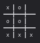

# Tic-Tac-Bot

## Explications et objectif
L'objectif de cet exercice est d'écrire une fonction qui permet de choisir le prochain tour à jouer au Tic-tac-toe de façon automatique. De cette façon, il sera possible de simuler une partie en faisant jouer l'ordinateur contre lui-même.



## Conception d'une AI

Pour écrire une fonction d'AI, vous devrer créer une fonction qui ressemble à ceci:

```js
function ma_super_ai(jeu, joueur, tour) {
    
    // return la position à jouer selon le jeu passé en paramètre
    return {
        x: 0,
        y: 0,
    }
}
```

Le paramètre `jeu` est l'état du jeu pour ce tour

Le paramètre `joueur` est le pion à utiliser lors de l'appel de la fonction `set(jeu, joueur)`

Le paramètre `tour` est à quel tour le jeu est rendu. Commence à 1 pour le premier tour et augmente à chaque nouveau tour.
- `X` aura donc les tours 1, 3, 5, 7, ...
- `O` aura les tours 2, 4, 6, 8, ...

Votre but est donc d'analyser l'état du jeu et choisir une des cases à jouer. Pour indiquer votre choix, vous devez faire un `return` d'un object javascript avec un `x` et un `y`, sachant que le coin haut gauche est `0, 0`. 

**Votre fonction sera appelée une fois par tour!**

## Liste des AI fournies pour tester votre code
- `ai_niveau_0`
- `ai_niveau_1`
- `ai_niveau_2`
- `ai_niveau_avance` (Si vous battez celle là, vous aurez droit à une médaille! haha)

## log_simulation(fonction_ai_1, fonction_ai_2)
Lance une partie automatique entre les deux fonctions d'AI données en paramètre

Affiche chaque étape de la simulation dans la console du navigateur

```js
log_simulation(ai_niveau_1, ai_niveau_2)
```

## log_simulation(fonction_ai_1, fonction_ai_2, nombre_de_parties)
Lance plusieurs parties automatiques entre les deux fonctions d'AI données en paramètre

Affiche les statistiques finales dans la console du navigateur

```js
simulation_stats(ai_niveau_1, ai_niveau_2, 10000)
```

## Constantes
- `X`
- `O`
- `VIDE`

## get(jeu, x, y)
Retourne ce qui est dans la case x, y

Ce sera la valeur d'une des constantes `X`, `O` ou `VIDE`

```js
if (get(jeu, 0, 0) == VIDE) {
```

## set(jeu, x, y, joueur)
Change la valeur de la case x,y pour le joueur.

joueur devrait être la constante `X` ou `O`

**Cette fonction retourne une copie du array de jeu!**

```js
jeu = set(jeu, 0, 0, X)
jeu = set(jeu, 1, 0, O)
```

## log_jeu(jeu)
Affiche l'état du jeu dans la console

```js
log_jeu(jeu)
```

## gagnant(jeu)
Permet de savoir s'il y a un gagnant. Retourne le gagnant ou `null`
```js 
if (gagnant(jeu) == X) {
```

## match_nul(jeu)
Permet de savoir s'il c'est un match null. Retourne `true` ou `false`
```js 
if (match_nul(jeu)) {
```

## coups_valides(jeu)
Retourne un array des coups valides pour le prochain tour.

Chaque élément est un objet : `{x: 0, y: 0}`

```js
let liste_coups = coups_valides(jeu)
```

## copy_jeu(jeu)
Crée une copie du jeu. Peu probable que vous ayez besoin de ça.

```js
let nouveau_jeu = copy_jeu(jeu)
```


<style type="text/css">
body { font-size: 22px;}
h1 { font-weight: bold; text-align: center; margin-bottom: 50px; border: none; }
h2 { margin-top: 30px; border-bottom: 1px dotted rgba(255,255,255,0.2); font-weight: bold;}
</style>